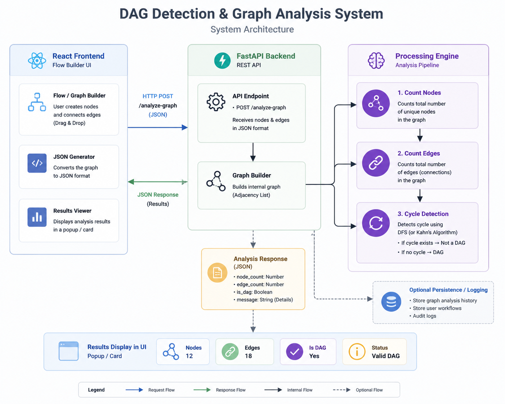

## A project that counts nodes, counts edges, and detects whether a graph is a DAG (Directed Acyclic Graph) is much more than an interview assessment. These operations are core building blocks in many real-world systems.
# 1. Workflow Automation (Most Common)
  This is one of the biggest use cases.
  

# Examples:
* Workflow automation platforms
* CI/CD pipelines
* AI workflow builders
* Data pipelines

### A workflow is represented as a graph:

#### Node → Task (API call, email, AI model, database)
#### Edge → Dependency between tasks

**Install Dependencies:**
   #### Backend :
   ```sh
   cd backend
   python -m venv venv
   .\venv\Scripts\Activate.ps1
   pip install -r requirements.txt
   python -m uvicorn main:app --reload 
   ```
   #### Frontend :
   ```sh
   cd frontend
   npm install
   npm run
   ```
